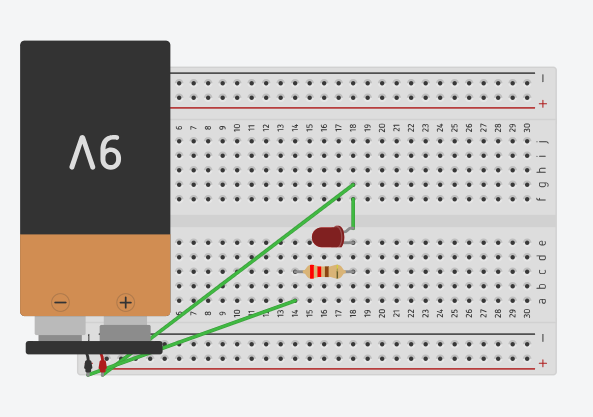

# Basic Battery LED Circuit

## Overview
This project is a very simple introduction to electronics.  
It shows how to power an **LED** using a **9V battery**, a **resistor**, and a **breadboard** without using an Arduino.

This beginner project helps in understanding:
- Basic circuit connections
- Power flow
- LED polarity
- The importance of resistors

---

## Components
- 9V Battery
- LED
- Resistor
- Breadboard
- Jumper Wires

---

## Wiring

### Connections
- Battery **positive (+)** → Resistor
- Resistor → LED **anode (+)**
- LED **cathode (-)** → Battery **negative (-)**

### LED Polarity
- **Long leg** = Anode (+)
- **Short leg** = Cathode (-)

The resistor is used to limit current and protect the LED from burning out.

---

## How It Works
- The battery provides electrical power
- Current flows through the resistor first
- The resistor reduces the current to a safe level
- The LED lights up when the circuit is complete

---

## Project Goal
- Learn the basics of an electrical circuit
- Understand how LEDs work
- Learn why resistors are important
- Practice breadboard wiring
